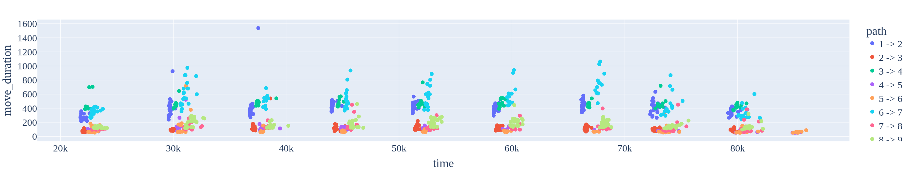

<div align=center>
  <h1>About</h1>
  <h2>This repository</h2>
  <p>This is a repository for source files for the <i>CI5304: Data Analytics and Visualization (DAVIS)</i> module's group assignment.</p><br />
  <table>
    <tr><th>Content</th><th>Description</th></tr>
    <tr><td><a href=notebook.ipynb>notebook.ipynb</a></td><td>Python notebook file imported from Colab</td></tr>
    <tr><td><a href=raw_dataset>raw_dataset</a></td><td>Directory containing the 26 .csv files</td></tr>
    <tr><td><a href=main.ts>main.ts</a></td><td>Entry point for the web-app</td></tr>
  </table>
  <hr>
</div>

## This project
### Raw data
A month's (26 .csv files) worth of records were provided containing the following features:</p>
- `bus id` $\in \\{13\\}$ - Bus identifier. In all .csv files provided, all records belong to bus #13
- `route id` $\in \\{8\\}$ - Route identifier. All records belong to route #8
- `place*n*` where $n \in \\{1, 2, ... 9\\}$ - Bus stop identifier
- `timestamp*n*_in` where $n \in \\{1, 2, ... 9\\}$ - Time of day $\in (\text{06:00},\text{23:59})$ at which the bus is recorded to arrive at this stop
- `timestamp*n*_out` where $n \in \\{1, 2, ... 9\\}$ - Time of day $\in (\text{06:00},\text{23:59})$ at which the bus is recorded to depart from this stop

In total, the 26 .csv files contains 270 rows, each containing (though in some cases missing) the above data.

### Instruction assigned
We were free to do as we please with the dataset and with the knowledge we learned from the module pretaining to Data Analytics and Visualization. We were also referred to the paper [Non-GPS-based ETA Models Constructed from Historical GPS Data and Traffic Contexts](https://ieeexplore.ieee.org/abstract/document/10147536) which similarly applies Machine Learning techniques to extract valuable information and construct prediction models which utilize a similar albeit larger dataset. We have thus decided to closely follow the approach taken in that project.

The concepts used mostly are similar to the ones applied in the aforementioned project. However the steps in producing the results are fully from our own mental and physical effort.

### ETA Approaches
Similar to the paper ["Non-GPS-based ..."](https://ieeexplore.ieee.org/abstract/document/10147536), we have employed three approaches in estimating estimated time of arrival (ETA) of busses based on information distilled from the raw data. Namely:
1. ETA from descriptive statistical measures ([see section](#descriptive-statistic-baseline-models)), describing the ETA central tendency from all observed data.
2. ETA from nonlinear regression models ([see section](#nonlinear-regression-models)), which are capable of describing ETA estimation with attention to the local context. These models are
   - k-nearest neighbors regressor (KNN),
   - decision tree regressor (DT),
   - and random forest regressor (RF).
4. ETA predicted from a tri-gram predictive model ([see section](#predictive-model)), which predicts the next ETA based on
   - its two preceding busstops’ in-between travel durations, as well as
   - local context of the traffic environment.

---

# Code
Everything is done in [notebook.ipynb](notebook.ipynb).

## Imports
The project makes use of the following packages & specific classes, most notably from [Plotly](https://plotly.com/python/), [scikit-learn](https://scikit-learn.org/stable/index.html), and [TensorFlow](https://www.tensorflow.org/).

```Python
# for plotting
import plotly.express as px
import plotly.subplots as sp
import plotly.graph_objects as go
from plotly.offline import iplot # producing plot htmls
from scipy.interpolate import griddata # surface plots

# for evaluating models
from sklearn.metrics import mean_squared_error

# data manipulation
import pandas as pd
import numpy as np
from datetime import datetime
from sklearn.model_selection import train_test_split
from sklearn.preprocessing import StandardScaler

# for ANN
import tensorflow as tf
from tensorflow import keras

# regressors
from sklearn.tree import DecisionTreeRegressor
from sklearn.ensemble import RandomForestRegressor
from sklearn.neighbors import KNeighborsRegressor

# For generating javascript function of decision tree regressor
from sklearn.tree import _tree
```

## Cleaning & Preparing Data
The raw dataset, described in [This Project > Raw Data](#raw-data), contains:
- unneeded columns
- some missing entries within the records

Thus, we _clean_ the dataset in response to the above by:
- dropping the unneeded columns, namely `bus_id`, `route_id`, `place*n*` (where $n \in \[0,9\]$)
- extracting meaningful pair of columns to generate meaningful data - new set of tuples - with the following features:
  - `path#` - indicates which path the tuple belongs to. $0,1,\ldots,7$ representing the paths _1<-2_, _2<-3_, ..., _8<-9_ respectively
  - `day#` - day of the week with $0,1,\ldots,6$ representing _Sunday_, _Monday_, ... _Saturday_ respectively
  - `time#` - descritized time of day with $0,1,\ldots,9$ representing _06:00-08:00_, _08:00_-_10:00_, ... _23:15_-_00:00_ respectively, which is the average time between the departure from bus stop $s_i$ and arrival time to bus stop $s_{{s+1}}$
  - `move_duration` - how long the travel takes - in seconds - from between busstops $s_i$ and $s_{{i+1}}$ in the path $s_i$_<-_$s_{{i+1}}$
  - `previous_move_duration` - same as above, but for the trip exactly before it, 0 if invalid
  - `previous_previous_move_duration` - same as above, but a step further
 
After cleaning the data, there are:
- **1209** total number of usable records that can be used for regressors
- **497** total number of records that can be used for the ANN Tri-gram model (records with valid `previous_move_duration` & `previous_move_duration` values)

### Conversion of time strings to integers (seconds)
Initially, the `timestamp_in` and `timestamp_out` columns of the original `DataFrame`s contains data of type string. To prepare them for processing, by the use of the following `to_seconds(column)` method, which accepts a `DataFrame` column as its argument, it is first converted to a Pandas datetime object, before the hours, minutes, and seconds are extracted and converted to seconds, ignoring the date. NaN values are converted to 0 for ease of processing
```Python
def to_seconds(column):
  time = pd.to_datetime(column, format= '%H:%M:%S' )
  time = time.fillna(datetime(2024,1,1)) # assign NaN -> 0
  return (time.dt.hour*60+time.dt.minute)*60 + time.dt.second
```

### Discretization of time
Before the decision to discretize the time of each record, we observed that each one of them fall into one of nine chunks, as illustrated below.
[](#)

In order to keep as much information as possible, while simplifying inputs to feed the models with, we have decided to discretize the time according to exactly these ten chunks, which are
- *06:00*-*08:00* -> 0,
- *08:00*-*10:00* -> 1,
- *10:00*-*12:00* -> 2,
- *12:00*-*13:30* -> 3,
- *13:30*-*16:00* -> 4,
- *16:00*-*17:30* -> 5,
- *17:30*-*19:30* -> 6,
- *19:30*-*21:30* -> 7,
- *21:30*-*23:15* -> 8 and
- *23:13*-*24:00* -> 9.

# Models
## Descriptive Statistic Baseline Models
## Nonlinear Regression Models
## Predictive Model
